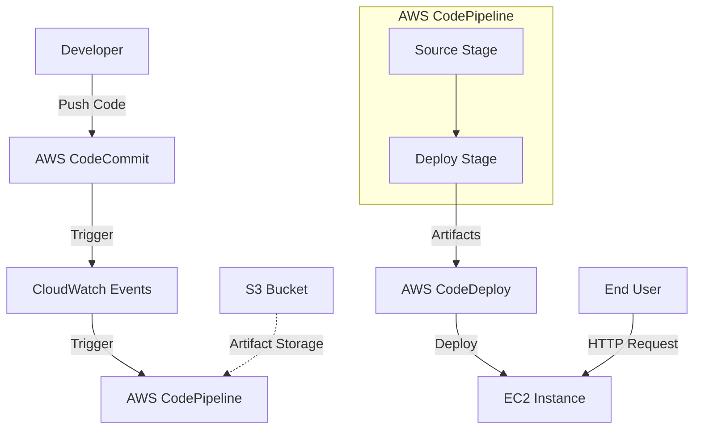
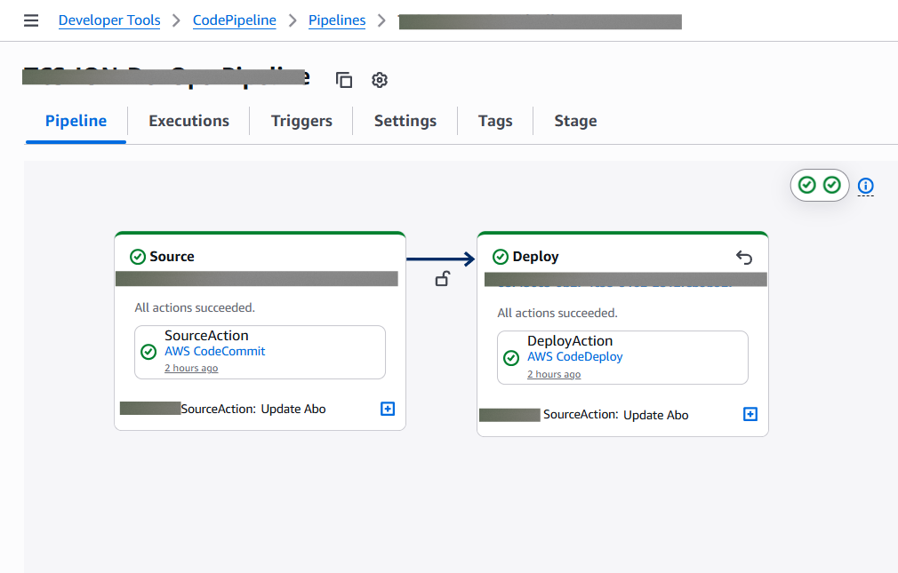
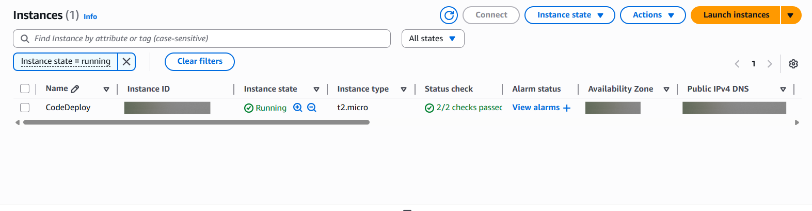
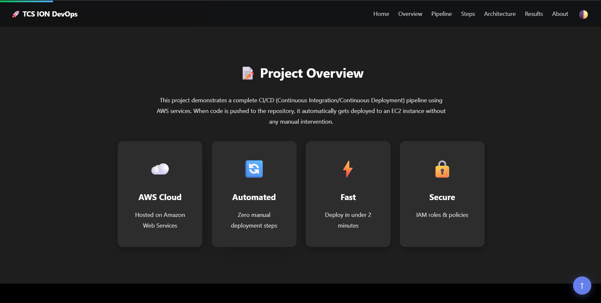

# Project Report: AWS Continuous Deployment Automation

## Table of Contents
1. [Acknowledgements](#acknowledgements)
2. [Objective and Scope](#objective-and-scope)
3. [Problem Statement](#problem-statement)
4. [Existing Approaches](#existing-approaches)
5. [Approach / Methodology - Tools and Technologies used](#approach--methodology)
6. [Workflow](#workflow)
7. [Assumptions](#assumptions)
8. [Implementation](#implementation)
9. [Solution Design](#solution-design)
10. [Challenges & Opportunities](#challenges--opportunities)
11. [Reflections on the project](#reflections-on-the-project)
12. [Recommendations](#recommendations)
13. [Outcome / Conclusion](#outcome--conclusion)
14. [Enhancement Scope](#enhancement-scope)
15. [Link to code and executable file](#link-to-code)
16. [Research questions and responses](#research-questions-and-responses)
17. [References](#references)
18. [Project Screenshots](#project-screenshots)

---

## Acknowledgements
I would like to express my gratitude to the instructors and mentors who provided the foundational knowledge of Cloud Computing and DevOps practices. Special thanks to the technical support resources and documentation provided by Amazon Web Services (AWS) which were instrumental in troubleshooting and implementing this solution.

## Objective and Scope
**Objective:** To design and implement a fully automated Continuous Integration and Continuous Deployment (CI/CD) pipeline on the AWS cloud platform for a static web application.
**Scope:** The project covers the end-to-end setup of infrastructure, including version control (CodeCommit), orchestration (CodePipeline), and deployment automation (CodeDeploy) onto virtual servers (EC2). It encompasses security configuration (IAM), script automation, and handling environmental differences in Linux distributions.

## Problem Statement
In traditional software development lifecycles, deploying updates to production servers is often a manual, error-prone, and time-consuming process. Manual file transfers (FTP/SCP) and server configuration management lead to "configuration drift," downtime, and a lack of audit trails. There is a need for a system that automatically deploys code changes immediately after a developer commits them, ensuring consistency and speed.

## Existing Approaches
*   **Manual Deployment:** Developers manually connect to servers via SSH to pull code or upload files via FTP. This is not scalable and prone to human error.
*   **Shell Scripting:** ad-hoc scripts triggered manually. While better than manual typing, they lack state management and visualization provided by modern CI/CD tools.

## Approach / Methodology - Tools and Technologies used
The project utilizes a cloud-native approach using AWS Developer Tools to create a serverless, managed pipeline.

**Tools & Technologies:**
*   **AWS CodeCommit:** Secure, highly scalable, managed source control service (Git-based).
*   **AWS CodeDeploy:** Fully managed deployment service that automates software deployments to compute services like Amazon EC2.
*   **AWS CodePipeline:** Fully managed continuous delivery service that helps automate release pipelines.
*   **Amazon EC2 (Elastic Compute Cloud):** Virtual servers running Amazon Linux 2.
*   **Apache HTTP Server (httpd):** The web server software used to host the application.
*   **IAM (Identity and Access Management):** For managing secure access (Roles and Policies).
*   **PowerShell & AWS CLI:** For programmatic setup of the infrastructure.

## Workflow
1.  **Source Stage:** Developer pushes code changes (HTML/CSS/Scripts) to the **CodeCommit** repository.
2.  **Trigger:** **CloudWatch Events** detects the change and triggers **CodePipeline**.
3.  **Deploy Stage:** CodePipeline passes the artifact to **CodeDeploy**.
4.  **Deployment Execution:**
    *   CodeDeploy agent on the **EC2 instance** pulls the artifact from S3 (artifact store).
    *   It executes the `appspec.yml` instructions.
    *   Runs lifecycle hooks (e.g., `after_install.sh`) to restart the web server.
5.  **Result:** The live website is updated instantly.

## Assumptions
*   The deployment target is a single EC2 instance (In-Place Deployment).
*   The application is a static website requiring an Apache web server.
*   The region for deployment is US East (N. Virginia), `us-east-1`.
*   The user has Administrative privileges to create IAM roles and provision resources.

## Implementation - Data collection, Processing Steps
The implementation was carried out in the following phases:

1.  **Environment Preparation:**
    *   Installed and configured AWS CLI v2.
    *   Granted appropriate IAM permissions (`AWSCodeCommitFullAccess`, `AWSCodeDeployFullAccess`, `AmazonEC2FullAccess`).

2.  **Security Setup (IAM):**
    *   Created `EC2InstanceRole` with policies to allow EC2 to communicate with CodeDeploy and S3.
    *   Created `CodeDeployServiceRole` to allow CodeDeploy to alter EC2 instances.

3.  **Infrastructure Provisioning:**
    *   Launched an **t2.micro** EC2 instance with **Amazon Linux 2**.
    *   Installed the CodeDeploy Agent on the instance using User Data scripts.
    *   Configured Security Groups to allow HTTP (80) and SSH (22) traffic.

4.  **Pipeline Configuration:**
    *   Created a repository: `TCS-ION-DevOps-App`.
    *   Created a deployment application and group: `TCS-ION-DevOps-DeployApp` / `TCS-ION-DevOps-DeployGroup`.
    *   Defined `appspec.yml` to map source files to `/var/www/html`.
    *   Created the pipeline `TCS-ION-DevOps-Pipeline` linking source and deploy stages.

## Solution Design
*   **Architecture:** A linear pipeline architecture.
*   **OS Choice:** Amazon Linux 2 was selected for its stability and native integration with AWS tools.
*   **Service Name Resolution:** Identified that Amazon Linux 2 uses `httpd` as the service name, whereas Ubuntu uses `apache2`. The automation scripts were designed to use `systemctl`.

### Architecture Diagram

## Challenges & Opportunities
**Challenges:**
1.  **Service Naming Conflicts:** Initial deployments failed because the `after_install.sh` script referenced `apache2` (common in Debian/Ubuntu), but the server was Amazon Linux 2 (which uses `httpd`).
    *   *Resolution:* Debugged deployment logs and updated the script to use `httpd`.
2.  **Region Consistency:** Confusion arose between `ap-south-1` and `us-east-1`.
    *   *Resolution:* Standardized all resources to `us-east-1` to ensure visibility and connectivity.

**Opportunities:**
*   The pipeline can be easily scaled to deploy to an Auto Scaling Group (ASG) instead of a single instance for high availability.

## Reflections on the project
This project highlighted the importance of "Configuration as Code." Small discrepancies in OS versions (Amazon Linux vs Ubuntu) can cause deployment failures. Automating the infrastructure setups showed the power of CLI tools over clicking through the console, providing a repeatable process.

## Recommendations
*   **Validation Testing:** Implement a "Test" stage in the pipeline to run automated checks before deploying to production.
*   **Infrastructure as Code:** Migrate the manual CLI commands into Terraform or CloudFormation templates for better disaster recovery.
*   **Load Balancing:** Place the EC2 instance behind an Application Load Balancer (ALB) and enable HTTPS for security.

## Outcome / Conclusion
We successfully established a fully automated DevOps pipeline. The final result is a functional documentation website hosted on an EC2 instance that updates automatically within minutes of a code commit. The implementation verifies the efficiency of AWS native developer tools for CI/CD workflows.

## Enhancement Scope
*   Integration of **Amazon SNS** for email notifications upon deployment success/failure.
*   Adding a build stage using **AWS CodeBuild** for compiling dynamic applications (e.g., Java/Node.js).
*   Blue/Green deployments to minimize downtime during updates.

## Link to code and executable file
*   **Repository Path:** `c:\Users\aarav\OneDrive\Desktop\aws project\repo-root`
*   **Public URL (Live):** http://3.80.45.209

## Research questions and responses
*   *Q: Why use CodeDeploy over simple Git pulls?*
    *   A: CodeDeploy offers lifecycle hooks (stop, install, validate), rollback capabilities, and traffic shifting which basic Git operations do not support.
*   *Q: How does the CodeDeploy Agent authenticate?*
    *   A: It uses the IAM Instance Profile attached to the EC2 instance, eliminating the need to store hardcoded credentials on the server.

## References
1.  AWS Documentation: CodePipeline User Guide.
2.  AWS Documentation: CodeDeploy AppSpec File Reference.
3.  Apache HTTP Server Project Documentation.

## Project Screenshots

### 1. AWS CodePipeline - Successful Execution

### 2. EC2 Instance Running

### 3. Live Website Deployment

